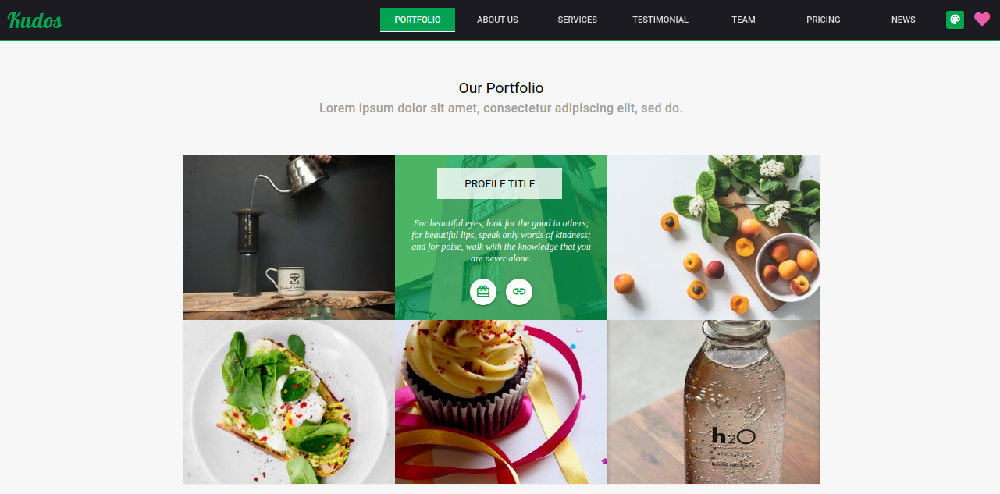
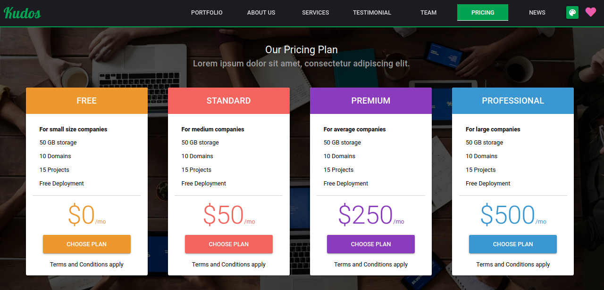
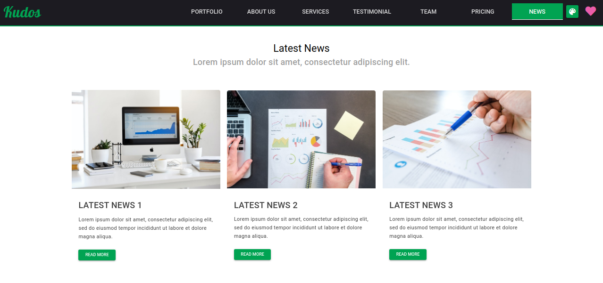

# Company Profile Website Template - Vue.js & Quasar Framework

Free template for company profile made using Quasar Framework and Vue.js! It is a fully responsive template which you can use for your company or maybe for your own portfolio website.

## Site: [https://dudusolutions.com/](https://dudusolutions.com/)

# Support

This project:

### [💜 GitHub](https://github.com/kiocjw)

Thank you very much!!

## Resources used
* [Quasar Framework](https://quasar.dev/)
* [Vue.js](https://vuejs.org/)

## Installation

* **Clone the repository**

```
git clone https://github.com/kiocjw/dudusolutions.git
```

## Install the dependencies
```bash
cd dudusolutions
npm install
```

### Start the app in development mode (hot-code reloading, error reporting, etc.)
```bash
quasar dev
```


### Build the app for production
```bash
quasar build
```

Do reach out to me at "kiocjw@gmail.com" for queries.

## Screens UI
**Home**
<p float="left">
	<kbd>

		</kbd>
</p>

**Portfolio**
<p float="left">
	<kbd>
	
	</kbd>
</p>

**Pricing**
<p float="left">
	<kbd>

	</kbd>
</p>

**News**
<p float="left">
	<kbd>

	</kbd>
</p>

### Customize the configuration
See [Configuring quasar.conf.js](https://quasar.dev/quasar-cli/quasar-conf-js).

## License

[MIT](http://opensource.org/licenses/MIT)
